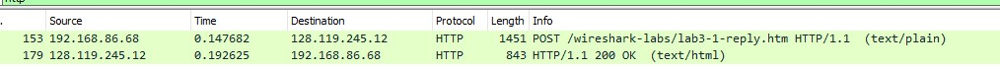

# hands-on-jarkom

Nama : Charles

NRP : 5025211082

## TCP Hands On
### No 1

Jawab :

IP : 192.168.86.68
Port : 55639

### No 2

Jawab :

128.119.245.12
Port : 80

### No 3 

Jawab :

Seq = 4236649187

### No 4

Jawab :

Seq = 1068969752
The ack has a value
Ack = 4236649188

### No 5

Jawab :

Seq = 4236649188
TCP Payload bytes : 1448
No

### No 6 

-

### No 7

Jawab :

Length : 1514

###No 8 

-

###No 9

Jawab :

yes there is, we can check from wireshark in the right
side which packet has tcp segment

### No 10

Jawab :

The length for each data received is 1448 bytes

### No 11

Jawab :

First we find the total packet bytes which is 154kb
And then we find the start and end time for the segment which is:
Start : 09:43:26.716922000
End : 09:43:26:840555000
Then we subtract it, we get : 0.123,633,000 second

### 12 

-

### 13 

-

### 14 

-

## UDP Hands On

### No 1

Jawab :

Packet number : 4
Port : 443 (HTTPS)
There is 4 fields : Source Port, Destination Port, Length, Checksum

### No 2

Jawab :

2 bytes each

### No 3

Jawab :

The length is length of header + payload which is 8 + 888 = 896

### No 4 

Jawab :

Because the length is represented with 2 bytes or 16 bit that means 
about 0 to 65,535 (2^16 - 1) can be represented as the length. As for the
UDP payload, that means 65535 - 8 = 65,527 bytes

### No 5 

Jawab :

The largest source port available is 65535 because it uses 2 bytes to represent it

### No 6 

Jawab :

The protocol number is 17 for UDP

### No 7

Jawab :

The first segment packet is number 4, the second one is 5.
The src port number for the first packet became the dst port for the second packet
and the dst port number for the first packet became the src port number for the 
second packet

